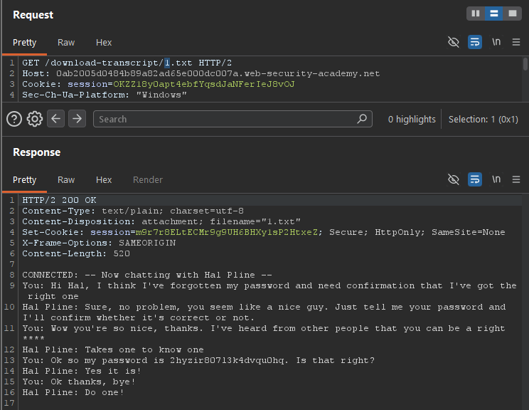
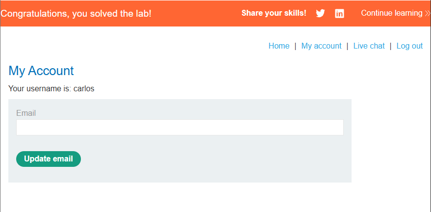

# Insecure Direct Object References (IDOR) — Broken Access Control

**Platform:** PortSwigger Web Security Academy

**Category:** Access Control (OWASP Top 10 2025 — A01: Broken Access Control)

**Difficulty:** Apprentice

## Objective
The application stores live chat transcripts on the server's file system and serves them via a predictable, sequentially-numbered URL. The goal is to exploit this to find another user's password and log in as them.

## Methodology
1. Started a live chat session and requested the transcript, which was served at `/download-transcript/2.txt`. The sequential, numeric filename suggested that other transcripts might exist at nearby, predictable IDs.
2. Sent the request to Burp Intruder, set the numeric ID as the payload position, and ran a Sniper attack using a Numbers payload list (range 0–20).

3. Reviewed the results: IDs `1` and `2` returned `200 OK`, while all other IDs (including `0`) returned `400`. ID `2` was the tester's own transcript; ID `1` belonged to another user.

*Note: a tool like AuthMatrix was considered but judged unnecessary here. AuthMatrix is built for systematically testing access across multiple roles and multiple endpoints — this lab involves a single endpoint and a single numeric parameter, so a straightforward Intruder Sniper attack was a better-scoped match for the actual complexity of the target.*

## Exploit
Manually retrieved `/download-transcript/1.txt`. It contained a chat transcript belonging to `carlos`, in which he was socially engineered by the other party ("Hal Pline") into disclosing his password directly in the chat: "Ok so my password is [redacted in report / visible in screenshot]. Is that right?"

## Proof of Concept
Logged in using the leaked credentials for `carlos`. The application confirmed the lab was solved immediately upon successful login — no further action was required.

## Root Cause
Two failures combined here:
- **Primary (in scope):** Transcript files were referenced using short, sequential, and easily enumerable identifiers, with no server-side check confirming that the requesting user actually owned the transcript being accessed. Any authenticated user could iterate through IDs and read anyone else's chat history.
- **Secondary observation (out of scope, but worth noting in a real engagement):** The transcript shows the user was socially engineered into typing their password directly into an unencrypted chat channel — a reminder that technical access control fixes alone don't address human/process-level risks like credential sharing over informal channels.

## Remediation
- Do not expose direct, sequential references to internal objects such as files or database records. Use unpredictable, non-enumerable identifiers (e.g., UUIDs) as a first layer of defense.
- More importantly, enforce a server-side authorization check on every transcript request, verifying that the requesting user's session actually owns the resource being accessed — an unguessable ID alone is not a substitute for real access control.
- Never transmit or persist credentials in plaintext through a support/chat channel; use secure, out-of-band credential recovery mechanisms instead.
