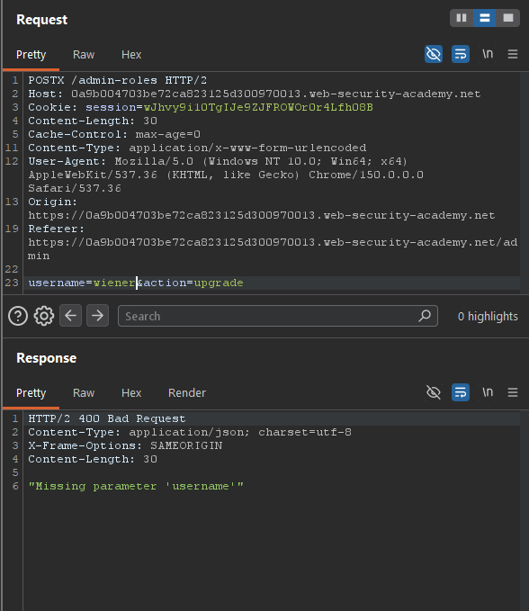
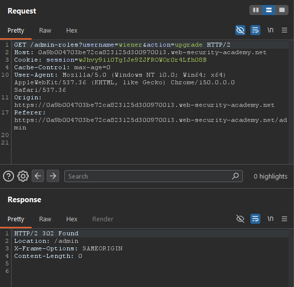
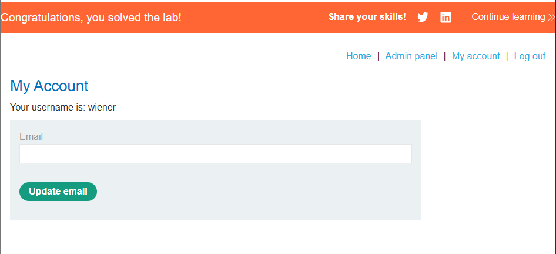

# Method-Based Access Control Can Be Circumvented — Broken Access Control

**Platform:** PortSwigger Web Security Academy

**Category:** Access Control (OWASP Top 10 2025 — A01: Broken Access Control)

**Difficulty:** Practitioner


## Objective
The application implements access controls based partly on the HTTP method of requests. The goal is to log in as the low-privileged user `wiener` and exploit the flawed access control to promote yourself to administrator.

## Methodology
1. Logged in with admin credentials (`administrator:admin`) and used the admin panel to promote the user `carlos`. Intercepted this request in Burp and sent it to Repeater:
 ```
 POST /admin-roles HTTP/2
...
username=carlos&action=upgrade
```
2. Logged out, then logged in as the low-privileged user `wiener:peter` in a separate session, and captured a fresh, valid session cookie for that account.
3. In Repeater, replaced the session cookie on the saved admin request with wiener's cookie and resent it as-is (still `POST`). The application responded `401 Unauthorized`, confirming this endpoint is protected against unauthorized `POST` requests.
4. To confirm where that check was enforced, resent the same request with an invalid method string, `POSTX`. The response changed from "Unauthorized" to `400 Bad Request — "Missing parameter 'username'"`.



   This confirmed the access control was not a real authorization check inside the application — it was a front-end/proxy rule doing a literal string match on `"POST"`. Anything that isn't an exact match (including a completely invalid method like `POSTX`) skips that layer entirely and reaches the application directly.

5. Used Burp's "Change request method" feature to convert the request to a valid `GET`, moving the parameters into the query string, and updated `username` from `carlos` to `wiener`:

   ``` GET /admin-roles?username=wiener&action=upgrade HTTP/2```

   ## Exploit
Sent the `GET` request with wiener's own session and username. The response was `302 Found`, redirecting to `/admin` — indicating the role change succeeded, since `GET` was never inspected by the enforcing layer at all.



## Proof of Concept
After the successful `GET` request, `wiener` was confirmed to have administrator privileges, and the lab was marked as solved.



## Root Cause
The access control check was enforced by a layer in front of the application (e.g., a reverse proxy or WAF rule) that only inspected requests using the exact literal string `"POST"`, rather than the application performing real, method-independent authorization on the action itself. This was directly confirmed: sending an invalid method (`POSTX`) bypassed the block and reached the application's own logic, which then failed only because the request body/parameters weren't in the expected place for that method — proving the enforcing layer, not the application, was the (incomplete) gatekeeper.

## Remediation
- Enforce authorization checks inside the application layer itself, independent of HTTP method — the check should apply to the *action being performed*, not to a specific verb.
- If a front-end/proxy layer is used for access control, ensure it normalizes and strictly validates the HTTP method (reject anything that isn't an exact, expected method) rather than matching only a specific known-good string.
- Apply defense in depth: the application should never assume a request reaching it has already been authorized by a perimeter control.
