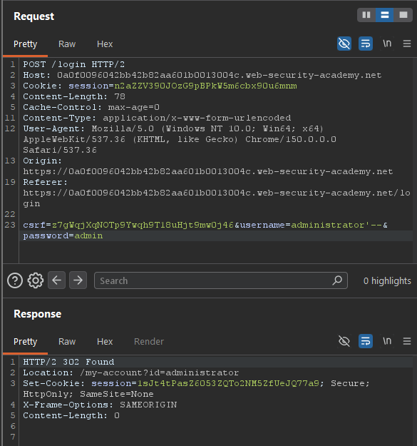
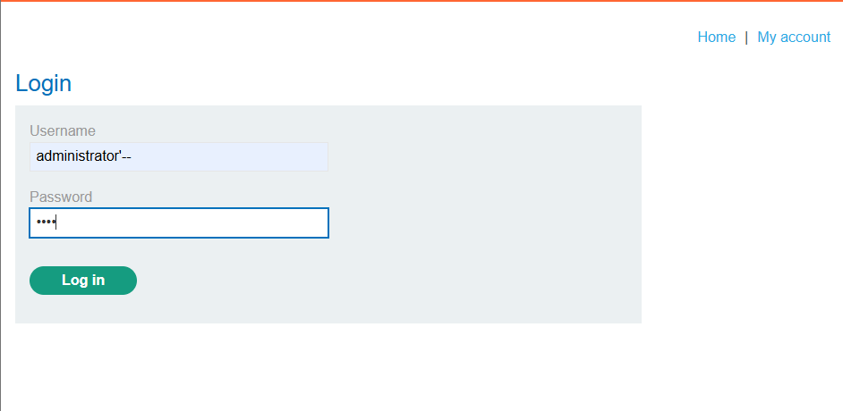

# SQL Injection Vulnerability Allowing Login Bypass — Injection

**Platform:** PortSwigger Web Security Academy

**Category:** Injection (OWASP Top 10 2025 — A05: Injection)

**Difficulty:** Apprentice


## Objective
The login function is vulnerable to SQL injection. The goal is to log in as the `administrator` user without knowing their password.

## Methodology
The login form was likely backed by a query similar to:

```
SELECT * FROM users WHERE username = 'INPUT' AND password = 'INPUT'
```

Submitted the username field as `administrator'--` with an arbitrary password. This breaks down into two distinct SQL behaviors:
- The single quote (`'`) closes the string literal the application wrapped around the input, ending the `username` value early from the database's perspective.
- The double dash (`--`) starts a SQL comment, causing the database to ignore everything after it on that line — including the entire `AND password = '...'` check.

The resulting query effectively became:
```sql
SELECT * FROM users WHERE username = 'administrator'--' AND password = '...'
```
with the password check never evaluated at all.

*Note on syntax: order and exact characters matter. A single `-` is just a minus sign in SQL and does not start a comment — two dashes (`--`) are required. Similarly, the sequence must close the string first and then comment out the rest (`'--`); reversing it (`--'`) leaves the string unterminated, so the dashes are treated as literal characters rather than a comment. The technique also requires targeting a username that actually exists in the database — the comment trick disables the password check, but the username itself must still return a matching row.*

## Exploit
Sent the crafted request via Burp Repeater:

```
POST /login HTTP/2
...
csrf=z7gWqjXqNOTp9Ywqh9Tl8uHjt9mwOj46&username=administrator'--&password=admin
```

The application responded `302 Found`, redirecting to `/my-account?id=administrator` — confirming the login bypass succeeded without knowing the real password.



## Proof of Concept
Repeated the same payload manually through the browser's login form to confirm it also works through the normal user flow, not just via Burp.



This logged in directly as `administrator`, and the application confirmed the lab was solved.


## Root Cause
User input was concatenated directly into a SQL query string without parameterization or sanitization. Because the application trusted the raw input to be safe, it was possible to inject SQL syntax that altered the logical structure of the query itself — turning an authentication check into a query that always returns a match, regardless of the password supplied.

## Remediation
- Use parameterized queries (prepared statements) for all database access, ensuring user input is always treated as data and never as executable SQL syntax.
- Apply the principle of least privilege to the database account used by the application, limiting the impact of any injection that does occur.
- Do not rely on input validation or blocklisting special characters (like quotes or dashes) as the primary defense — parameterization is the only reliable fix; validation is, at best, a secondary layer.
