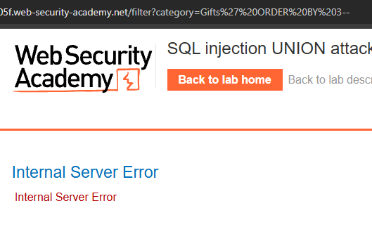
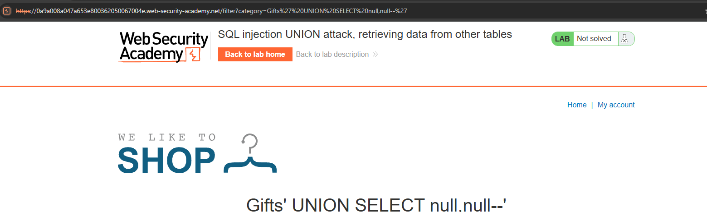
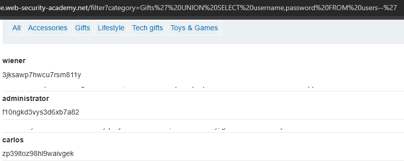
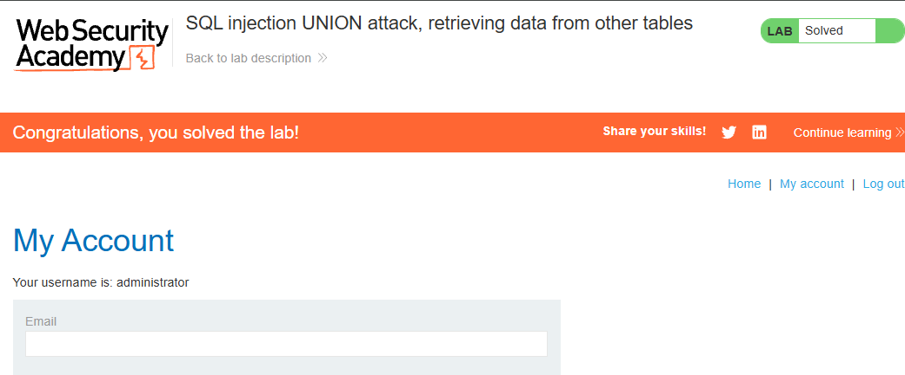

# SQL Injection UNION Attack, Retrieving Data from Other Tables — Injection

**Platform:** PortSwigger Web Security Academy

**Category:** Injection (OWASP Top 10 2025 — A05: Injection)

**Difficulty:** Practitioner

**Date:** [2026-09-22]

## Objective
The product category filter is vulnerable to SQL injection, and query results are reflected in the application's response. The goal is to perform a UNION attack to retrieve all usernames and passwords from the `users` table and log in as `administrator`.

## Methodology

1. **Determined the number of columns returned by the original query.** Since the `category` parameter's results are reflected on the page, a UNION attack requires matching the exact column count of the original query. This was confirmed by incrementing `ORDER BY` until an error was returned:
```
   ?category=Gifts' ORDER BY 3--
```
   This returned an error, confirming the query returns exactly **2 columns**.

   

2. **Confirmed the injection point and column count with a UNION SELECT of NULLs:**
```
   ?category=Gifts' UNION SELECT null,null--
```
   The payload was reflected directly in the page as a heading, confirming both the injection worked and that the query returns 2 columns.

   

3. **Identified which column accepts text data** by replacing each `null` with a string value one at a time:
```
   ?category=Gifts' UNION SELECT 'test',null--
   ?category=Gifts' UNION SELECT 'test','test11'--
```
   Both positions accepted string values without error, confirming either column could be used to extract text data.

4. **Extracted credentials from the `users` table** by replacing the two columns with `username` and `password`:
```
   ?category=Gifts' UNION SELECT username,password FROM users--
```

## Exploit
The query returned every row from the `users` table, reflected directly on the page alongside the normal product listings — including credentials for `wiener`, `administrator`, and `carlos`.



## Proof of Concept
Logged in using the extracted `administrator` credentials. The application confirmed the lab was solved.



## Root Cause
User input from the `category` parameter was concatenated directly into a SQL query without parameterization, and — critically — the application reflected raw query results back into the page. This combination allowed an attacker to not only alter the query's logic (as in a login bypass) but to append an entirely separate query via `UNION` and read its output directly, effectively turning an unrelated product filter into a full data exfiltration channel.

## Remediation
- Use parameterized queries (prepared statements) for all database access — this alone would have prevented the injection entirely.
- Apply least privilege to the database account used by the application; a read-restricted account limits what a successful UNION attack can retrieve.
- Avoid reflecting raw, unfiltered query results back to the client. Even with parameterized queries elsewhere, over-permissive error messages or verbose output can aid an attacker in later stages of an attack.
