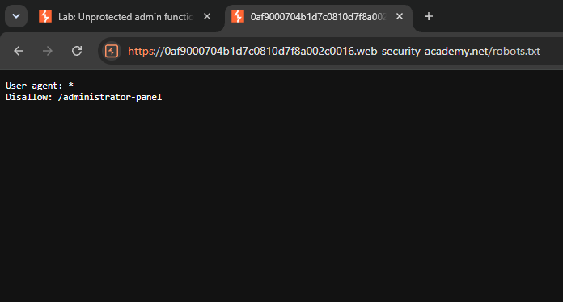
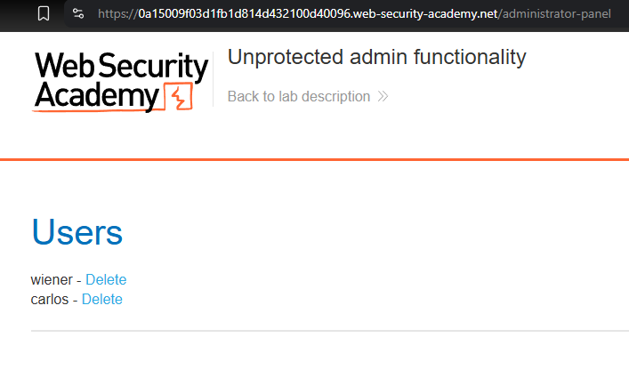
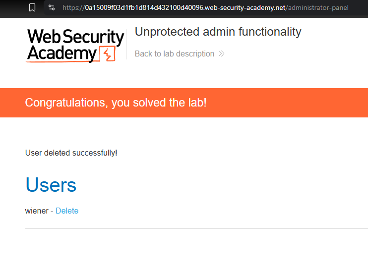

# Unprotected Admin Functionality — Broken Access Control

**Platform:** PortSwigger Web Security Academy

**Category:** Access Control (OWASP Top 10 2025 — A01: Broken Access Control)

**Difficulty:** Apprentice

## Objective
The lab contains an unprotected admin panel. The goal is to locate the admin panel and delete the user `carlos`.

## Methodology
1. Explored the application as a standard shop website; no admin link was visible in the UI or page source.
2. Checked `robots.txt`, a standard file used to tell search engine crawlers which paths to exclude from indexing.
3. The file disclosed a `Disallow: /administrator-panel` entry, revealing the existence and location of the admin panel.

## Exploit
Navigated directly to `/administrator-panel`. No authentication was required — the panel exposed full user management functionality, including the ability to delete any user account.

## Proof of Concept
Selected the user `carlos` from the admin panel and deleted the account without ever authenticating. The application confirmed the lab as solved.

## Root Cause
The admin panel relied on "security through obscurity" — an unguessable-looking URL — instead of a real access control check. Two failures combined here:
- The panel's location was disclosed through a public file (`robots.txt`) that was never meant to act as a security boundary; it exists to guide search engine crawlers, not to hide sensitive functionality.
- More critically, the panel performed **no server-side check** to confirm the requesting user was authenticated and held an administrator role before allowing a destructive action like deleting a user.

## Remediation
- Enforce server-side authentication and role-based authorization (RBAC) on every admin endpoint and action, regardless of how unpredictable the URL is.
- Never treat a hidden or hard-to-guess URL as a security control — obscurity is not access control.
- Avoid listing sensitive paths in `robots.txt`. If a path must stay private, protect it with authentication rather than just omitting it from search indexing, since `robots.txt` is publicly readable and non-compliant crawlers or attackers can ignore it entirely.
